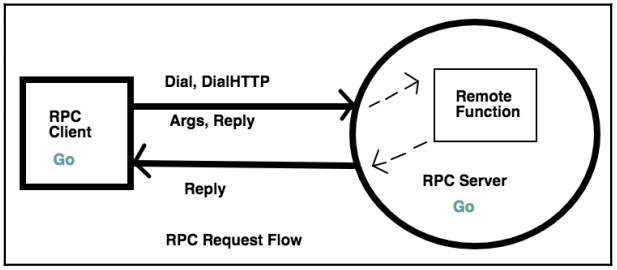

## What is RPC?

RPC (Remote Procedure Call) is an inter-process communication that exchanges information between various distributed systems (servers).
It is a protocol that one program can use to request a service from a program located on some other node/server/computer/system on the network without having to understand the network's details.

In simple words, a computer `A` can **call** a function(**procedures**) in another computer `B` **remotely**. Hence, _Remote Procedure Call_.

The basic steps for the entire process are as:

1. Client (system `A`) decides the function name and arguments to send
2. Client send the same to the `RPC Server` by dialing the connection
3. The RPC server receives the function name and arguments
4. RPC server invokes/executes the function on the remote system `B`
5. The client collects the data from the request

As you can see, it is a `synchronous` process.



Go provides a library for both **RPC Server** and **RPC Client**
In the above diagram, the client sends the arguments and the reply pointer. Since it is a pointer, the server can modify it as per the request. The client will then use the data filled into the pointer.

---

## Creating an RPC server

Let us now create an RPC server that will send the UTC server time to the RPC client. We will use `net/rpc` and `net/http` standard packages for this example.

**NOTE** The RPC Server and RPC Client should agree upon:

- Arguments passed
- Value Returned

_And must have exactly same types for both server and client_

Let us create an `Args` struct to hold the arguments received from the client and `TimeServer` type using which we will register our function on RPC server for clients to run it.

```Go
type Args struct {}

type TimeServer int64
```

Now let us create the `GiveTimeServer` function which will be invoked from the client.

```Go
func (t *TimeServer) GiveServerTime(args *Args, reply *int64) error {
	// Set the value at the pointer got from the client
	*reply = time.Now().Unix()
	return nil
}
```

Now let us register the methods listening on type TimeServer on the RPC server:

```Go
/* server.go */

func main() {
	timeserver := new(TimeServer)
	// Register the timeserver object upon which the GiveServerTime
	// function will be called from the RPC server (from the client)
	rpc.Register(timeserver)
	// Registers an HTTP handler for RPC messages
	rpc.HandleHTTP()
	// Start listening for the requests on port 1234
	listener, err := net.Listen("tcp", "0.0.0.0:1234")
	if err !=nil {
		log.Fatal("Listener error: ", err)
	}
	// Serve accepts incoming HTTP connections on the listener l, creating
	// a new service goroutine for each. The service goroutines read requests
	// and then call handler to reply to them
	http.Serve(listener, nil)
}
```

That's it from the server side.

---

## Creating an RPC client

We will create the struct for Args (its empty in this example). And a `reply` variable which must have SAME type as that of server.

```Go
/* client.go */

package main

import (
	"log"
	"net/rpc"
)

type Args struct {}

func main() {
	// Address to this variable will be sent to the RPC server
	// Type of reply should be same as that specified on server
	var reply int64
	args := Args{}

	// DialHTTP connects to an HTTP RPC server at the specified network
	client, err := rpc.DialHTTP("tcp", "0.0.0.0:1234")
	if err != nil {
		log.Fatal("Client connection error: ", err)
	}

	// Invoke the remote function GiveServerTime attached to TimeServer pointer
	// Sending the arguments and reply variable address to the server as well
	err = client.Call("TimeServer.GiveServerTime", args, &reply)
	if err != nil {
		log.Fatal("Client invocation error: ", err)
	}

	// Print the reply from the server
	log.Printf("%d", reply)
}

```

That was pretty straight forward. We just created a client and connected it to the host and port on which server is listening on.

Then we used the Call function to invoke a function tied to the TimeServer type and passed in `args` and `&reply` pointer.

Now let us start the `server.go` program.

```
$ go run server.go
```

Now let us start the `client.go` program and as soon as we do that, we will see the server's reply of it's current UTC time:

```
$ go run client.go
2021/09/04 18:36:37 1630760797 // 👈
```

That's it. It's that simple. I hope you guys understood how the client and server connection works via RPC server. In future blogs, we will dive deeper into the same topic and cover more on RPC and also GRPC.
